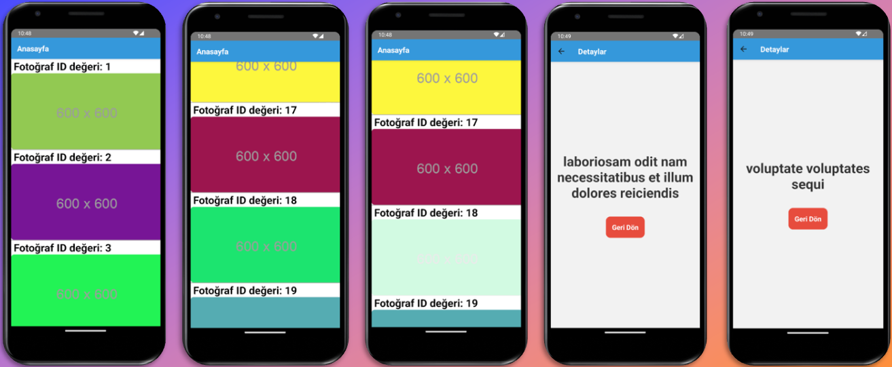

````md

# 🖼️ Temel Seviye Listeleme Uygulaması

Bu proje, internet üzerinden çekilen verilerle bir resim galerisi oluşturan ve galerideki her bir resim tıklandığında ilgili detayları gösteren bir temel seviye React Native uygulamasıdır.  
Uygulama, FlatList, TouchableOpacity ve Navigation Container kullanılarak oluşturulmuş, Axios ile veri çekmektedir.

---

## 🛠️ Kullanılan Teknolojiler
- **React Native**
- **React Navigation (Navigation Container ve Stack Navigator)**
- **Axios**
- **FlatList**
- **TouchableOpacity**
- **useState ve useEffect Hookları**
- **JavaScript**

---

## ✨ Özellikler
- **Resim Galerisi:** İnternetten çekilen resimler FlatList ile listelenir.
- **Resim Detayları:** Her bir resme tıklandığında ayrı bir sayfada resim detayları gösterilir.
- **Navigasyon:** Stack Navigator kullanılarak Anasayfa ve Detaylar ekranları arasında geçiş yapılır.
- **Veri Çekme:** Axios ile API’den veriler alınır ve ekranda gösterilir.
- **Dinamik Listeleme:** FlatList ile uzun veri setleri performanslı şekilde görüntülenir.

---

## 📋 Gereksinimler
- **Node.js**
- **React Native CLI**
- **Android Studio / Xcode**
- Fiziksel cihaz veya emulator

---

## 🚀 Kurulum
1. **Proje Dizinine Gidin:**
   ```bash
   cd deneme3
````

2. **Gerekli Paketleri Yükleyin:**

   ```bash
   npm install
   ```

3. **Uygulamayı Çalıştırın:**

   ```bash
   npm run android
   ```

   veya

   ```bash
   npm run ios
   ```

---

## ⚙️ Kullanılan State ve Veri Akışı

* **useState:** API’den çekilen resim verilerini saklamak için kullanılır.
* **useEffect:** Uygulama açıldığında verileri çekmek için kullanılır.
* **Navigasyon Params:** Resim detay sayfasına resim ID’si gönderilir.

---

## 📸 Ekran Görüntüleri



```
```

